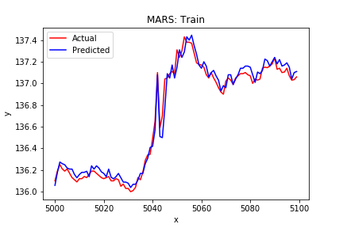
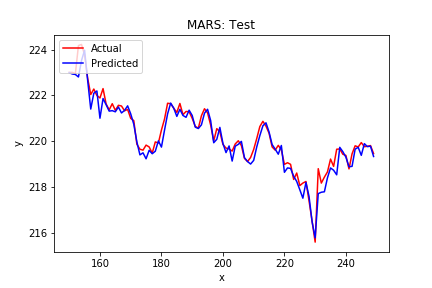
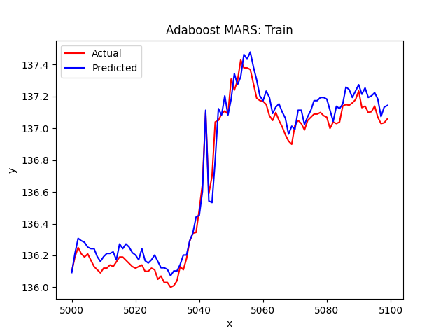
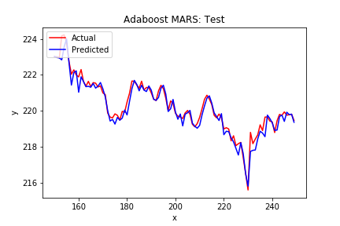
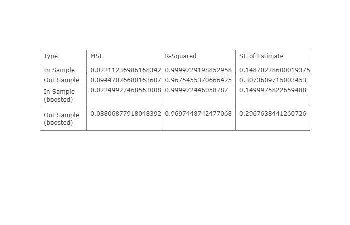

# MARS-Time-Series
Multivariate Adaptive Regression Splines for Time Series Prediction

Python Script to fit a MARS model to 5-minute Apple stock data to predict the high at a given interval

**Requirments**
- numpy
- pandas
- matplotlib
- scipy
- [py-earth](https://github.com/scikit-learn-contrib/py-earth/tree/v0.2dev)
- sklearn
- [ta-lib](https://www.lfd.uci.edu/~gohlke/pythonlibs/#ta-lib)

The general premise of this model is to use the Open price and a select few technical indicators, namely a 7-period Standard deviation and Hilbert Transform Dominant cycle period both calculated with the Open price. the Close, High, Low, and Volume were removed from the training set since these values are definitively formed only posteriorly, thus the Open price and its transformations were used.

Predicting the Close price proved to be unavailing in testing so prediction of the High price for a given 5-minute interval was chosen instead.

Each feature was normalized with a log(feature + 1) transformation and then fit to the default MARS model from py-earth

**In Sample Results** (Zoomed in):

**Out Sample Results** (Zoomed in):

The model was then passed through the AdaBoostRegressor boosting method

**In Sample Adaboost Results** (Zoomed in):

**Out Sample Adaboost Results** (Zoomed in):

the results were then measued with mean squared error, R-squared, and Standard Error of the Estimate:

The average estimate error for the boosted model turns out to be ~ $0.28 out of sample
